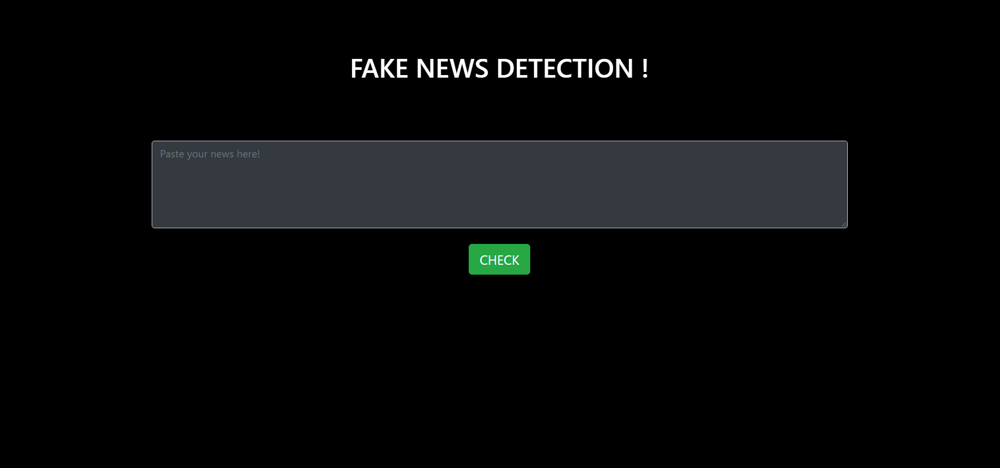
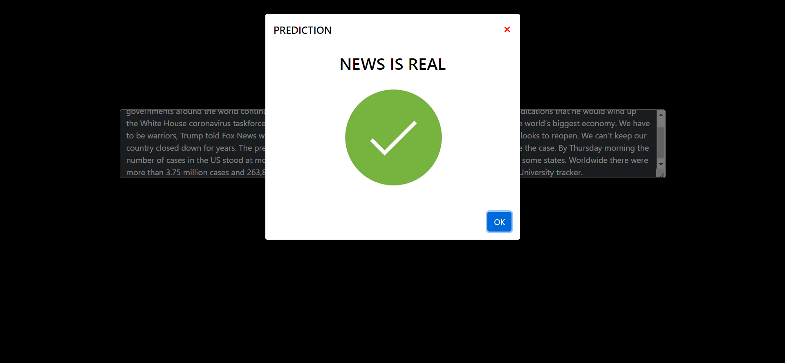

# Fake News Detection

This is a flask application that detects and identifies the fake or real news. The flask framework provides a robust and agile development environment and this application is based on the same. The `train_model_fakenews.py` can be used to tweak this model for further usage. The `news.csv` file contains the dataset used for the model's training. 

## Algorithm used
* Passive Aggressive Classifier - used for training and fitting.
* TfidfVectorizer - used for vectorizing the input textual data and transform it.

## Screenshots

Paste the news:

Press 'check' to predict the news:

